# OpenMPT for AI: path to a personally useful vertical slice 的阻塞关系图

来源：[`map.md`](map.md)；Map 类型为 `wayfinder:map`。方向约定为「阻塞任务 → 被其阻塞的任务」。

预览：[`blocking-graph.svg`](blocking-graph.svg)。

```mermaid
flowchart LR
    I01["01 Pin the Upstream Baseline and source workflow<br/>Type: research<br/>Status: resolved"]
    I02["02 Inventory OpenMPT capabilities and architectural seams<br/>Type: research<br/>Status: resolved"]
    I03["03 Prototype Piano Roll projection and editing semantics<br/>Type: prototype<br/>Status: resolved"]
    I04["04 Evaluate symbolic Score Context representations<br/>Type: research<br/>Status: resolved"]
    I05["05 Define the shared Application Capability boundary<br/>Type: grilling<br/>Status: resolved"]
    I06["06 Choose MCP sidecar IPC and lifecycle<br/>Type: grilling<br/>Status: resolved"]
    I07["07 Choose the AI Score Context and Audio Preview contract<br/>Type: grilling<br/>Status: resolved"]
    I08["08 Prototype the reviewable AI change workflow<br/>Type: prototype<br/>Status: resolved"]
    I09["09 Choose the independent project&#x27;s distribution model<br/>Type: grilling<br/>Status: resolved"]
    I10["10 Define Piano Roll workspace state and synchronization<br/>Type: grilling<br/>Status: resolved"]
    I11["11 Choose the independent product identity<br/>Type: grilling<br/>Status: resolved"]
    I12["12 Bootstrap the pinned upstream source tree<br/>Type: task<br/>Status: resolved"]
    I13["13 Establish the reproducible build and CI baseline<br/>Type: task<br/>Status: resolved"]
    I14["14 Package the installer, portable application, and MCP Sidecar<br/>Type: task<br/>Status: resolved"]
    I15["15 Audit release licenses and source distribution<br/>Type: task<br/>Status: resolved"]
    I16["16 Verify compatibility and distribution lifecycle<br/>Type: task<br/>Status: resolved"]
    I17["17 Publish the first Developer Preview<br/>Type: task<br/>Status: resolved"]
    I18["18 Harden post-preview distribution and maintenance<br/>Type: research<br/>Status: resolved"]
    I19["19 Prototype Piano Roll Focus subordinate Tracker UI<br/>Type: prototype<br/>Status: resolved"]
    I20["20 Define the first personally useful vertical slice<br/>Type: grilling<br/>Status: resolved"]
    I21["21 Establish the smallest local build-and-run loop<br/>Type: task<br/>Status: resolved"]
    I22["22 Prototype the synchronized Piano Roll editing slice<br/>Type: prototype<br/>Status: resolved"]
    I23["23 Choose the minimum AI Pattern capability slice<br/>Type: grilling<br/>Status: resolved"]
    I24["24 Prototype the local MCP round trip<br/>Type: prototype<br/>Status: resolved"]
    I25["25 Prototype the first proposal-review-apply loop<br/>Type: prototype<br/>Status: resolved"]
    I26["26 Implement the first personal vertical slice: Piano Roll editing with a local AI proposal loop<br/>Type: spec<br/>Status: open"]
    I27["27 27: Piano Roll pane into the main development line<br/>Type: unknown<br/>Status: ready-for-agent"]
    I28["28 28: MPTM collaboration fixture<br/>Type: unknown<br/>Status: ready-for-agent"]
    I29["29 29: Pattern capability seam with the five Pattern-mode tools<br/>Type: unknown<br/>Status: ready-for-agent"]
    I30["30 30: App-side IPC broker with owning-thread dispatch<br/>Type: unknown<br/>Status: ready-for-agent"]
    I31["31 31: MCP Sidecar process (stdio translator)<br/>Type: unknown<br/>Status: ready-for-agent"]
    I32["32 32: Proposal review UI and atomic Apply in the app<br/>Type: unknown<br/>Status: ready-for-agent"]
    I33["33 33: End-to-end Agent loop: melody↔harmony both directions<br/>Type: unknown<br/>Status: ready-for-agent"]
    I34["34 34: Vertical-slice verification: Save As, reopen, human keep-verdict<br/>Type: unknown<br/>Status: ready-for-agent"]
    I05 --> I10
    I09 --> I10
    I09 --> I11
    I01 --> I12
    I09 --> I12
    I12 --> I13
    I06 --> I14
    I11 --> I14
    I13 --> I14
    I12 --> I15
    I13 --> I15
    I03 --> I16
    I14 --> I16
    I15 --> I16
    I16 --> I17
    I17 --> I18
    I03 --> I19
    I10 --> I19
    I22 --> I19
    I25 --> I19
    I12 --> I21
    I20 --> I21
    I03 --> I22
    I10 --> I22
    I20 --> I22
    I21 --> I22
    I05 --> I23
    I20 --> I23
    I06 --> I24
    I21 --> I24
    I23 --> I24
    I08 --> I25
    I22 --> I25
    I23 --> I25
    I24 --> I25
    I19 --> I26
    I20 --> I26
    I21 --> I26
    I22 --> I26
    I23 --> I26
    I24 --> I26
    I25 --> I26
    I28 --> I29
    I29 --> I30
    I30 --> I31
    I29 --> I32
    I27 --> I33
    I28 --> I33
    I31 --> I33
    I32 --> I33
    I33 --> I34
    linkStyle 0 stroke:#15803d,stroke-width:3px;
    linkStyle 1 stroke:#15803d,stroke-width:3px;
    linkStyle 2 stroke:#15803d,stroke-width:3px;
    linkStyle 3 stroke:#15803d,stroke-width:3px;
    linkStyle 4 stroke:#15803d,stroke-width:3px;
    linkStyle 5 stroke:#15803d,stroke-width:3px;
    linkStyle 6 stroke:#15803d,stroke-width:3px;
    linkStyle 7 stroke:#15803d,stroke-width:3px;
    linkStyle 8 stroke:#15803d,stroke-width:3px;
    linkStyle 9 stroke:#15803d,stroke-width:3px;
    linkStyle 10 stroke:#15803d,stroke-width:3px;
    linkStyle 11 stroke:#15803d,stroke-width:3px;
    linkStyle 12 stroke:#15803d,stroke-width:3px;
    linkStyle 13 stroke:#15803d,stroke-width:3px;
    linkStyle 14 stroke:#15803d,stroke-width:3px;
    linkStyle 15 stroke:#15803d,stroke-width:3px;
    linkStyle 16 stroke:#15803d,stroke-width:3px;
    linkStyle 17 stroke:#15803d,stroke-width:3px;
    linkStyle 18 stroke:#15803d,stroke-width:3px;
    linkStyle 19 stroke:#15803d,stroke-width:3px;
    linkStyle 20 stroke:#15803d,stroke-width:3px;
    linkStyle 21 stroke:#15803d,stroke-width:3px;
    linkStyle 22 stroke:#15803d,stroke-width:3px;
    linkStyle 23 stroke:#15803d,stroke-width:3px;
    linkStyle 24 stroke:#15803d,stroke-width:3px;
    linkStyle 25 stroke:#15803d,stroke-width:3px;
    linkStyle 26 stroke:#15803d,stroke-width:3px;
    linkStyle 27 stroke:#15803d,stroke-width:3px;
    linkStyle 28 stroke:#15803d,stroke-width:3px;
    linkStyle 29 stroke:#15803d,stroke-width:3px;
    linkStyle 30 stroke:#15803d,stroke-width:3px;
    linkStyle 31 stroke:#15803d,stroke-width:3px;
    linkStyle 32 stroke:#15803d,stroke-width:3px;
    linkStyle 33 stroke:#15803d,stroke-width:3px;
    linkStyle 34 stroke:#15803d,stroke-width:3px;
    linkStyle 35 stroke:#15803d,stroke-width:3px;
    linkStyle 36 stroke:#15803d,stroke-width:3px;
    linkStyle 37 stroke:#15803d,stroke-width:3px;
    linkStyle 38 stroke:#15803d,stroke-width:3px;
    linkStyle 39 stroke:#15803d,stroke-width:3px;
    linkStyle 40 stroke:#15803d,stroke-width:3px;
    linkStyle 41 stroke:#15803d,stroke-width:3px;
    linkStyle 42 stroke:#c2410c,stroke-width:3px,stroke-dasharray:8 6;
    linkStyle 43 stroke:#c2410c,stroke-width:3px,stroke-dasharray:8 6;
    linkStyle 44 stroke:#c2410c,stroke-width:3px,stroke-dasharray:8 6;
    linkStyle 45 stroke:#c2410c,stroke-width:3px,stroke-dasharray:8 6;
    linkStyle 46 stroke:#c2410c,stroke-width:3px,stroke-dasharray:8 6;
    linkStyle 47 stroke:#c2410c,stroke-width:3px,stroke-dasharray:8 6;
    linkStyle 48 stroke:#c2410c,stroke-width:3px,stroke-dasharray:8 6;
    linkStyle 49 stroke:#c2410c,stroke-width:3px,stroke-dasharray:8 6;
    linkStyle 50 stroke:#c2410c,stroke-width:3px,stroke-dasharray:8 6;
    classDef status_resolved fill:#dcfce7,stroke:#15803d,color:#14532d;
    classDef status_open fill:#f8fafc,stroke:#64748b,color:#334155;
    classDef status_ready_for_agent fill:#ede9fe,stroke:#7c3aed,color:#4c1d95;
    class I01,I02,I03,I04,I05,I06,I07,I08,I09,I10,I11,I12,I13,I14,I15,I16,I17,I18,I19,I20,I21,I22,I23,I24,I25 status_resolved;
    class I26 status_open;
    class I27,I28,I29,I30,I31,I32,I33,I34 status_ready_for_agent;
```

## 当前解读

| 任务 | 类型 | 状态 | 当前仍未解除的上游阻塞 |
| --- | --- | --- | --- |
| [01 Pin the Upstream Baseline and source workflow](issues/01-pin-upstream-baseline.md) | `research` | `resolved` | — |
| [02 Inventory OpenMPT capabilities and architectural seams](issues/02-inventory-application-capabilities.md) | `research` | `resolved` | — |
| [03 Prototype Piano Roll projection and editing semantics](issues/03-prototype-piano-roll-semantics.md) | `prototype` | `resolved` | — |
| [04 Evaluate symbolic Score Context representations](issues/04-research-symbolic-score-context.md) | `research` | `resolved` | — |
| [05 Define the shared Application Capability boundary](issues/05-define-shared-capability-boundary.md) | `grilling` | `resolved` | — |
| [06 Choose MCP sidecar IPC and lifecycle](issues/06-choose-sidecar-ipc-lifecycle.md) | `grilling` | `resolved` | — |
| [07 Choose the AI Score Context and Audio Preview contract](issues/07-choose-ai-context-contract.md) | `grilling` | `resolved` | — |
| [08 Prototype the reviewable AI change workflow](issues/08-prototype-reviewable-change-workflow.md) | `prototype` | `resolved` | — |
| [09 Choose the independent project's distribution model](issues/09-choose-project-distribution-model.md) | `grilling` | `resolved` | — |
| [10 Define Piano Roll workspace state and synchronization](issues/10-define-piano-roll-workspace-state.md) | `grilling` | `resolved` | — |
| [11 Choose the independent product identity](issues/11-choose-independent-product-identity.md) | `grilling` | `resolved` | — |
| [12 Bootstrap the pinned upstream source tree](issues/12-bootstrap-upstream-source-tree.md) | `task` | `resolved` | — |
| [13 Establish the reproducible build and CI baseline](issues/13-establish-reproducible-build-ci.md) | `task` | `resolved` | — |
| [14 Package the installer, portable application, and MCP Sidecar](issues/14-package-installer-portable-sidecar.md) | `task` | `resolved` | — |
| [15 Audit release licenses and source distribution](issues/15-audit-release-licenses-source.md) | `task` | `resolved` | — |
| [16 Verify compatibility and distribution lifecycle](issues/16-verify-distribution-compatibility-lifecycle.md) | `task` | `resolved` | — |
| [17 Publish the first Developer Preview](issues/17-publish-developer-preview.md) | `task` | `resolved` | — |
| [18 Harden post-preview distribution and maintenance](issues/18-harden-post-preview-distribution.md) | `research` | `resolved` | — |
| [19 Prototype Piano Roll Focus subordinate Tracker UI](issues/19-prototype-piano-roll-focus-subordinate-tracker.md) | `prototype` | `resolved` | — |
| [20 Define the first personally useful vertical slice](issues/20-define-first-personally-useful-vertical-slice.md) | `grilling` | `resolved` | — |
| [21 Establish the smallest local build-and-run loop](issues/21-establish-smallest-local-build-run-loop.md) | `task` | `resolved` | — |
| [22 Prototype the synchronized Piano Roll editing slice](issues/22-prototype-synchronized-piano-roll-editing-slice.md) | `prototype` | `resolved` | — |
| [23 Choose the minimum AI Pattern capability slice](issues/23-choose-minimum-ai-pattern-capability-slice.md) | `grilling` | `resolved` | — |
| [24 Prototype the local MCP round trip](issues/24-prototype-local-mcp-round-trip.md) | `prototype` | `resolved` | — |
| [25 Prototype the first proposal-review-apply loop](issues/25-prototype-first-proposal-review-apply-loop.md) | `prototype` | `resolved` | — |
| [26 Implement the first personal vertical slice: Piano Roll editing with a local AI proposal loop](issues/26-implement-first-personal-vertical-slice.md) | `spec` | `open` | — |
| [27 27: Piano Roll pane into the main development line](issues/27-merge-piano-roll-pane-mainline.md) | `unknown` | `ready-for-agent` | — |
| [28 28: MPTM collaboration fixture](issues/28-create-mptm-collaboration-fixture.md) | `unknown` | `ready-for-agent` | — |
| [29 29: Pattern capability seam with the five Pattern-mode tools](issues/29-pattern-capability-seam-five-tools.md) | `unknown` | `ready-for-agent` | [28 28: MPTM collaboration fixture](issues/28-create-mptm-collaboration-fixture.md) |
| [30 30: App-side IPC broker with owning-thread dispatch](issues/30-app-side-ipc-broker-owning-thread-dispatch.md) | `unknown` | `ready-for-agent` | [29 29: Pattern capability seam with the five Pattern-mode tools](issues/29-pattern-capability-seam-five-tools.md) |
| [31 31: MCP Sidecar process (stdio translator)](issues/31-mcp-sidecar-stdio-translator.md) | `unknown` | `ready-for-agent` | [30 30: App-side IPC broker with owning-thread dispatch](issues/30-app-side-ipc-broker-owning-thread-dispatch.md) |
| [32 32: Proposal review UI and atomic Apply in the app](issues/32-proposal-review-ui-atomic-apply.md) | `unknown` | `ready-for-agent` | [29 29: Pattern capability seam with the five Pattern-mode tools](issues/29-pattern-capability-seam-five-tools.md) |
| [33 33: End-to-end Agent loop: melody↔harmony both directions](issues/33-end-to-end-agent-loop-both-directions.md) | `unknown` | `ready-for-agent` | [27 27: Piano Roll pane into the main development line](issues/27-merge-piano-roll-pane-mainline.md), [28 28: MPTM collaboration fixture](issues/28-create-mptm-collaboration-fixture.md), [31 31: MCP Sidecar process (stdio translator)](issues/31-mcp-sidecar-stdio-translator.md), [32 32: Proposal review UI and atomic Apply in the app](issues/32-proposal-review-ui-atomic-apply.md) |
| [34 34: Vertical-slice verification: Save As, reopen, human keep-verdict](issues/34-vertical-slice-verification-save-reopen-verdict.md) | `unknown` | `ready-for-agent` | [33 33: End-to-end Agent loop: melody↔harmony both directions](issues/33-end-to-end-agent-loop-both-directions.md) |

- 节点数：34；依赖边数：51。
- 当前开放且无未解除上游阻塞的任务：[26 Implement the first personal vertical slice: Piano Roll editing with a local AI proposal loop](issues/26-implement-first-personal-vertical-slice.md), [27 27: Piano Roll pane into the main development line](issues/27-merge-piano-roll-pane-mainline.md), [28 28: MPTM collaboration fixture](issues/28-create-mptm-collaboration-fixture.md)。
- 其中已 claimed 的任务：—。

## 校验提示

- ticket 27 has no Type field
- ticket 28 has no Type field
- ticket 29 has no Type field
- ticket 30 has no Type field
- ticket 31 has no Type field
- ticket 32 has no Type field
- ticket 33 has no Type field
- ticket 34 has no Type field
