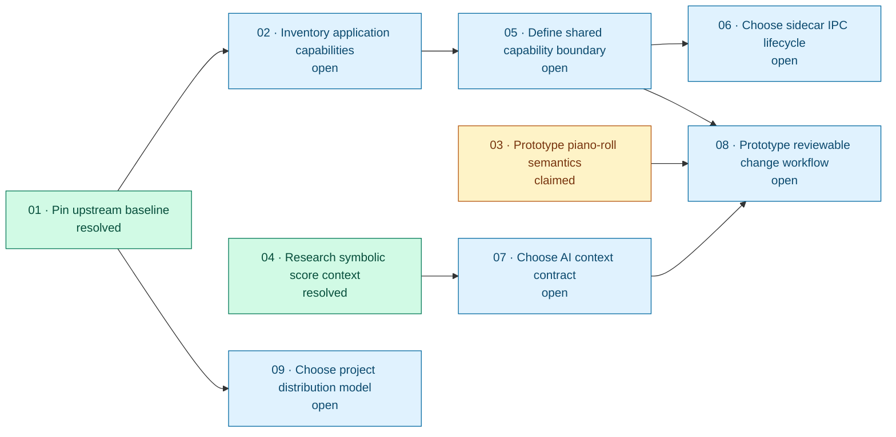

# Issue blocking relationships

Arrows point from a prerequisite issue to the issue it blocks.

## Legend

- Green: resolved
- Amber: claimed
- Blue: open

## Direct blocking relationships

| Prerequisite | Blocked issue |
| --- | --- |
| 01 | 02, 09 |
| 02 | 05 |
| 03 | 08 |
| 04 | 07 |
| 05 | 06, 08 |
| 07 | 08 |

