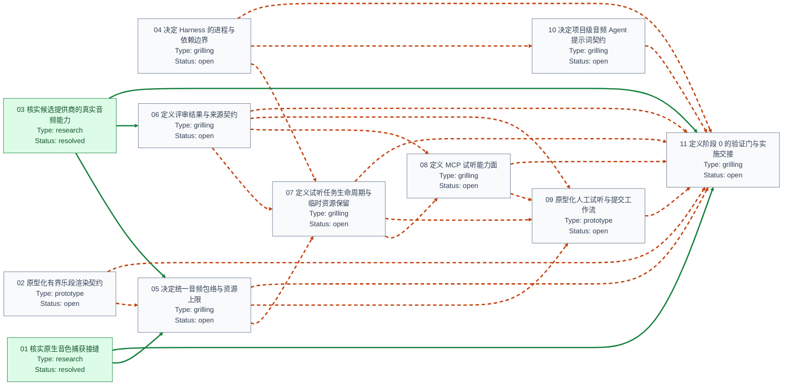

# Harness 音频分析内核：从已接受方案到可实施契约 的阻塞关系图

来源：[`map.md`](map.md)；Map 类型为 `wayfinder:map`。方向约定为「阻塞任务 → 被其阻塞的任务」。

预览：[`blocking-graph.svg`](blocking-graph.svg)。

## 当前解读

| 任务 | 类型 | 状态 | 当前仍未解除的上游阻塞 |
| --- | --- | --- | --- |
| [01 核实原生音色捕获接缝](issues/01-verify-native-timbre-capture-seam.md) | `research` | `resolved` | — |
| [02 原型化有界乐段渲染契约](issues/02-prototype-bounded-passage-render-contract.md) | `prototype` | `open` | — |
| [03 核实候选提供商的真实音频能力](issues/03-research-provider-audio-capabilities.md) | `research` | `resolved` | — |
| [04 决定 Harness 的进程与依赖边界](issues/04-choose-harness-process-boundary.md) | `grilling` | `open` | — |
| [05 决定统一音频包络与资源上限](issues/05-choose-unified-audio-envelope.md) | `grilling` | `open` | [02 原型化有界乐段渲染契约](issues/02-prototype-bounded-passage-render-contract.md) |
| [06 定义评审结果与来源契约](issues/06-define-review-and-provenance-contracts.md) | `grilling` | `open` | — |
| [07 定义试听任务生命周期与临时资源保留](issues/07-define-audition-task-lifecycle.md) | `grilling` | `open` | [04 决定 Harness 的进程与依赖边界](issues/04-choose-harness-process-boundary.md), [05 决定统一音频包络与资源上限](issues/05-choose-unified-audio-envelope.md), [06 定义评审结果与来源契约](issues/06-define-review-and-provenance-contracts.md) |
| [08 定义 MCP 试听能力面](issues/08-define-mcp-audition-surface.md) | `grilling` | `open` | [06 定义评审结果与来源契约](issues/06-define-review-and-provenance-contracts.md), [07 定义试听任务生命周期与临时资源保留](issues/07-define-audition-task-lifecycle.md) |
| [09 原型化人工试听与提交工作流](issues/09-prototype-human-audition-workflow.md) | `prototype` | `open` | [05 决定统一音频包络与资源上限](issues/05-choose-unified-audio-envelope.md), [06 定义评审结果与来源契约](issues/06-define-review-and-provenance-contracts.md), [07 定义试听任务生命周期与临时资源保留](issues/07-define-audition-task-lifecycle.md), [08 定义 MCP 试听能力面](issues/08-define-mcp-audition-surface.md) |
| [10 决定项目级音频 Agent 提示词契约](issues/10-choose-project-audio-agent-prompt-contract.md) | `grilling` | `open` | [04 决定 Harness 的进程与依赖边界](issues/04-choose-harness-process-boundary.md) |
| [11 定义阶段 0 的验证门与实施交接](issues/11-define-phase-zero-verification-gate.md) | `grilling` | `open` | [02 原型化有界乐段渲染契约](issues/02-prototype-bounded-passage-render-contract.md), [04 决定 Harness 的进程与依赖边界](issues/04-choose-harness-process-boundary.md), [05 决定统一音频包络与资源上限](issues/05-choose-unified-audio-envelope.md), [06 定义评审结果与来源契约](issues/06-define-review-and-provenance-contracts.md), [07 定义试听任务生命周期与临时资源保留](issues/07-define-audition-task-lifecycle.md), [08 定义 MCP 试听能力面](issues/08-define-mcp-audition-surface.md), [09 原型化人工试听与提交工作流](issues/09-prototype-human-audition-workflow.md), [10 决定项目级音频 Agent 提示词契约](issues/10-choose-project-audio-agent-prompt-contract.md) |

- 节点数：11；依赖边数：24。
- 当前开放且无未解除上游阻塞的任务：[02 原型化有界乐段渲染契约](issues/02-prototype-bounded-passage-render-contract.md), [04 决定 Harness 的进程与依赖边界](issues/04-choose-harness-process-boundary.md), [06 定义评审结果与来源契约](issues/06-define-review-and-provenance-contracts.md)。
- 其中已 claimed 的任务：—。
