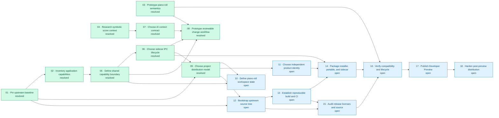

# Issue blocking relationships

Arrows point from a prerequisite issue to the issue it blocks.

## Legend

- Green: resolved
- Amber: claimed
- Blue: open

## Direct blocking relationships

| Prerequisite | Blocked issue |
| --- | --- |
| 01 | 02, 09, 12 |
| 02 | 05 |
| 03 | 08, 16 |
| 04 | 07 |
| 05 | 06, 08, 10 |
| 06 | 08, 09, 14 |
| 07 | 08 |
| 09 | 10, 11, 12 |
| 11 | 14 |
| 12 | 13, 15 |
| 13 | 14, 15 |
| 14 | 16 |
| 15 | 16 |
| 16 | 17 |
| 17 | 18 |
