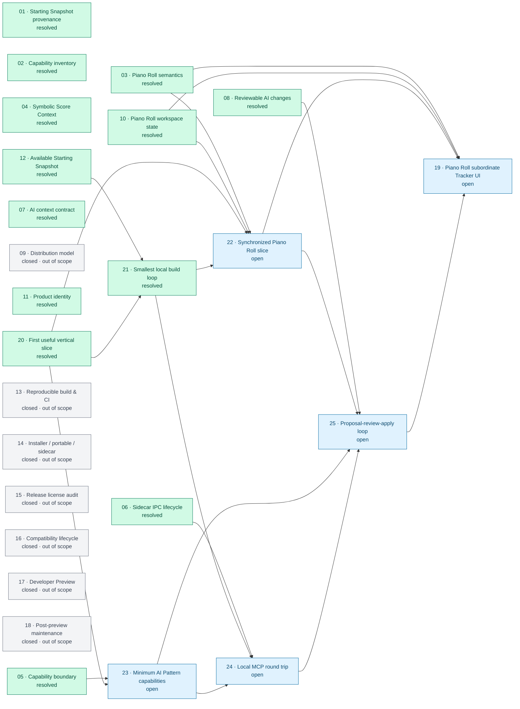

# OpenMPT issue blocking relationships

当前快照：`issues` 目录中的 25 个 issue。箭头表示各 issue 文件中声明的直接阻塞关系；节点颜色区分已解决、开放和因当前目的地收缩而关闭的历史票据。

## 图例

- 绿色：`resolved`
- 蓝色：`open`
- 灰色：因当前目的地收缩而关闭，不属于 Decisions so far

## 直接阻塞关系

| 前置 ticket | 被阻塞 ticket |
| --- | --- |
| Piano Roll projection and editing semantics | Synchronized Piano Roll editing slice；Piano Roll Focus subordinate Tracker UI |
| Shared Application Capability boundary | Minimum AI Pattern capability slice |
| Local MCP sidecar IPC and lifecycle | Local MCP round trip |
| Reviewable AI change workflow | First proposal-review-apply loop |
| Piano Roll workspace state and synchronization | Synchronized Piano Roll editing slice；Piano Roll Focus subordinate Tracker UI |
| Available OpenMPT starting source | Smallest local build-and-run loop |
| First personally useful vertical slice | Smallest local build-and-run loop；Synchronized Piano Roll editing slice；Minimum AI Pattern capability slice |
| Smallest local build-and-run loop | Synchronized Piano Roll editing slice；Local MCP round trip |
| Synchronized Piano Roll editing slice | First proposal-review-apply loop；Piano Roll Focus subordinate Tracker UI |
| Minimum AI Pattern capability slice | Local MCP round trip；First proposal-review-apply loop |
| Local MCP round trip | First proposal-review-apply loop |
| First proposal-review-apply loop | Piano Roll Focus subordinate Tracker UI |

当前开放前沿是 `19`、`22`、`23`、`24`、`25`。其中 `22` 依赖已解决的 `03`、`10`、`20`、`21`；`23` 依赖已解决的 `05`、`20`；`22` 与 `23` 汇入 `24` 和 `25`，最终 `25` 与 `22` 一起阻塞 `19`。`09`、`13`–`18` 虽在元数据中为 `resolved`，但正文明确标记为当前目的地之外关闭，因此以灰色历史节点展示。
