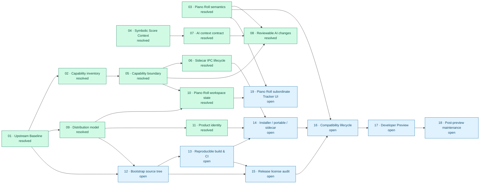

# OpenMPT issue blocking relationships

当前快照：`issues` 目录中的 19 个 issue。箭头从前置 issue 指向被其阻塞的 issue；节点颜色表示当前状态。

## 图例

- 绿色：`resolved`
- 蓝色：`open`

## 直接阻塞关系

| 前置 issue | 被阻塞 issue |
| --- | --- |
| 01 | 02、09、12 |
| 02 | 05 |
| 03 | 08、16、19 |
| 04 | 07 |
| 05 | 06、08、10 |
| 06 | 14 |
| 07 | 08 |
| 09 | 10、11、12 |
| 10 | 19 |
| 11 | 14 |
| 12 | 13、15 |
| 13 | 14、15 |
| 14 | 16 |
| 15 | 16 |
| 16 | 17 |
| 17 | 18 |

当前未解决的开放链路最终汇聚到 `16 → 17 → 18`，而 `19` 是由 `03` 与 `10` 汇聚的 Piano Roll UI 支线。
